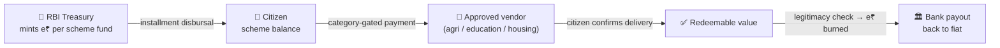

<div align="center">

# 🇮🇳 BharatChain

### Corruption-proof welfare delivery on a public ledger

**Every rupee of government welfare — traceable from the RBI treasury to the citizen to the shop counter, with zero personal data exposed.**

[](packages/contracts)
[](packages/circuits)
[](apps/backend)
[](apps/web)
[](apps/indexer)
[](apps/backend/test)
[](apps/web/src/lib/translations.public.ts)
[](package.json)

*Built end-to-end as a fully working prototype on a **$0, free & open-source stack**.*

</div>

---

## The problem

Welfare leakage is a last-mile problem: funds are announced at the top but siphoned, diverted, or double-claimed before they reach real beneficiaries. Auditing is slow, paper-based, and after-the-fact.

## The idea

Put the **money itself** on rails it cannot leave:



- **e₹** is a transfer-restricted digital rupee (1 e₹ = ₹1). No peer-to-peer transfers, no cash-out shortcuts — it moves **only** citizen → approved, category-matched vendor.
- **Eligibility is proven, not disclosed.** A zero-knowledge proof (Groth16) shows a citizen matches the government registry's criteria **without revealing who they are or any attribute**. An identity-derived nullifier makes double-enrollment cryptographically impossible.
- **Delivery is part of the money flow.** Vendors can only redeem value that citizens have confirmed receiving — fake invoices earn nothing.
- **Everything is publicly auditable** on a PII-free GraphQL ledger, while an automated monitor flags fraud patterns (fan-in, velocity, self-dealing) in real time.

## Feature highlights

| | Feature | How |
|---|---|---|
| 🔐 | **Zero-knowledge eligibility** | Circom circuits prove scheme-specific predicates (income for PM-Kisan, caste-based NSP for education, PMAY-G attributes for housing) against a fixed 10,000-record government registry — no personal data revealed, on-chain verifier enforced |
| 🪙 | **Transfer-restricted e₹** | Restricted ERC-20: mint by treasury, spend only via the payment router to category-matched approved vendors, burn on redemption |
| 🧾 | **Proof-of-delivery** | Only citizen-confirmed payments become redeemable; RBI reviews vendor legitimacy (ITR) before burn + payout |
| 🕵️ | **Fraud analytics** | Kafka event stream → anomaly engine (FAN_IN / VELOCITY / SELF_DEAL) → oversight dashboards |
| 📊 | **Public ledger** | Self-hosted The Graph subgraph indexes 6 contracts into an open, PII-free GraphQL API |
| 🗣️ | **14-language portal** | Full public site + citizen/vendor portals in English + 13 Indian languages, Urdu RTL included |
| 🤖 | **AI assistant, two surfaces** | Anonymous *info desk* (schemes, how-it-works, registration walkthroughs — zero personal data on that path) and a citizen-gated *personal mode* doing RAG over the citizen's own records. Pluggable LLM (Groq/Gemini/Ollama) with a deterministic grounded fallback at $0 |
| 🇮🇳 | **Sovereign AI path** | [`ai-model/`](ai-model/README.md): fine-tune & self-host the assistant (Ollama Modelfile or QLoRA) so model **and** data stay on national infrastructure |
| 🔑 | **Keyless UX** | Citizens and vendors never touch wallets or gas — a hardened server-side relayer signs; login is phone + OTP |

## Architecture

```
apps/
  backend/      NestJS — auth (OTP, lockout, sessions) · ZK enrolment · disbursal engine (+ cron)
                category-gated payments · proof-of-delivery · redemption · Kafka anomaly detection
                AI assistant (public info-desk + citizen RAG)
  web/          Unified National Welfare Portal (Vite + React + TS)          :3000
                role-routed: public · citizen · vendor · operations surfaces
  indexer/      The Graph subgraph — the public welfare ledger
packages/
  contracts/    Solidity + Hardhat + OpenZeppelin — e₹ token, scheme hub, registries,
                disbursal, payment router, redemption
  circuits/     Circom + snarkjs — per-scheme eligibility & vendor-registry circuits
  registry/     Fixed 10,000-record government reference registry (committed fixture)
  shared/       Shared TypeScript types & enums
ai-model/       Sovereign assistant model — dataset builder + QLoRA pipeline + Modelfile
infra/          Docker Compose — Postgres · Redis · Kafka (KRaft) · Graph Node + IPFS · MinIO
docs/           Project summary · implementation plan · demo script
```

## Quick start

**Prerequisites:** Node.js ≥ 20 · npm · Docker Desktop · git *(circom only if you rebuild ZK artifacts)*

```bash
npm install
cp .env.example .env          # everything defaults to free/local

# One command: infra + local chain + deploy + seed + backend
powershell -ExecutionPolicy Bypass -File scripts/demo-up.ps1

# then the portal:
npm run dev -w @bharatchain/web        # → http://localhost:3000
```

<details>
<summary>Manual steps (instead of <code>demo-up.ps1</code>)</summary>

```bash
npm run infra:up
npm run node -w @bharatchain/contracts        # separate shell
npm run deploy:local -w @bharatchain/contracts
npm run build -w @bharatchain/backend
npm run seed  -w @bharatchain/backend
npm run start:prod -w @bharatchain/backend
```
</details>

The full guided tour — sign-up, a real ZK enrolment, disbursal, payment, delivery, redemption, fraud alerts, the assistant — lives in [`docs/DEMO.md`](docs/DEMO.md).

## Tests & CI

```bash
npm run contracts:test                 # Hardhat suite — includes a real Groth16 proof verified on-chain
npm test -w @bharatchain/backend       # 121 unit tests, infra-free
```

CI ([`.github/workflows/ci.yml`](.github/workflows/ci.yml)) gates every push on the contract suite, the backend suite, and the web build.

## Deploying to a free L2 testnet

```bash
# set AMOY_RPC_URL (Polygon Amoy) or ARBITRUM_SEPOLIA_RPC_URL in .env, fund the relayer, then:
npm run deploy:amoy -w @bharatchain/contracts
# point the backend at it:  CHAIN_NETWORK=amoy
```

## Privacy & security posture

- **No PII on-chain — ever.** Only cryptographic commitments and one-time nullifiers touch the ledger.
- **The AI assistant cannot leak identity data**: its retrieval context is a strict whitelist (no phone, PAN, document IDs, or addresses), identity comes only from the JWT, and the anonymous surface never loads personal data at all.
- Hardened auth: OTP rate-limiting, login lockout, refresh-token rotation, session heartbeat; per-role route guards; DTO validation everywhere; upload size caps.
- Every relayer write is serialized and revert-mapped; double-enrolment is blocked by the ZK nullifier even at the contract level.

## Data sovereignty (AI)

The assistant is fully functional at $0 with a deterministic grounded responder, and upgrades to a real LLM the moment a key is set (`LLM_PROVIDER` / `GROQ_API_KEY` / `GEMINI_API_KEY`, or Ollama via `OLLAMA_URL` + `OLLAMA_MODEL`, default `bharatchain-assistant`). For national deployment, [`ai-model/`](ai-model/README.md) fine-tunes a self-hosted open base (Llama / Sarvam / AI4Bharat) so the model **and** the data never leave sovereign infrastructure.

---

<div align="center">

📚 **Deep dive:** [`docs/PROJECT_SUMMARY.md`](docs/PROJECT_SUMMARY.md) · [`docs/IMPLEMENTATION_PLAN.md`](docs/IMPLEMENTATION_PLAN.md) · [`docs/DEMO.md`](docs/DEMO.md)

*Prototype for demonstration — no real funds; SMS and bank payouts are simulated; no PII ever goes on-chain.*

</div>
